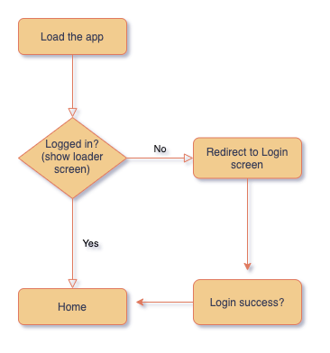
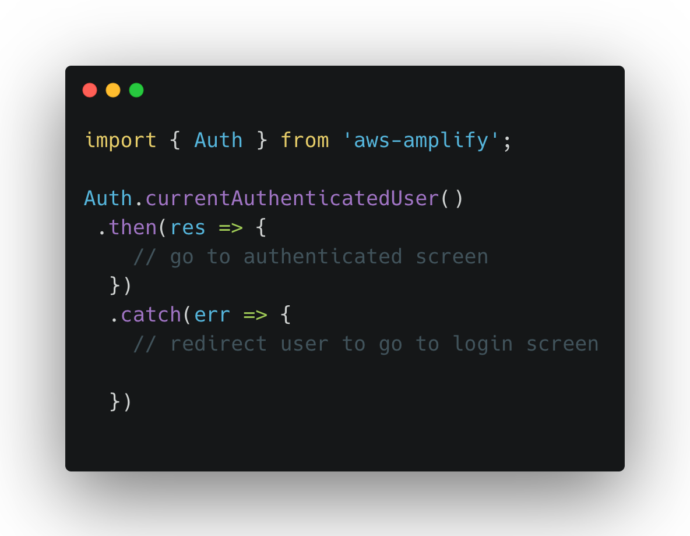
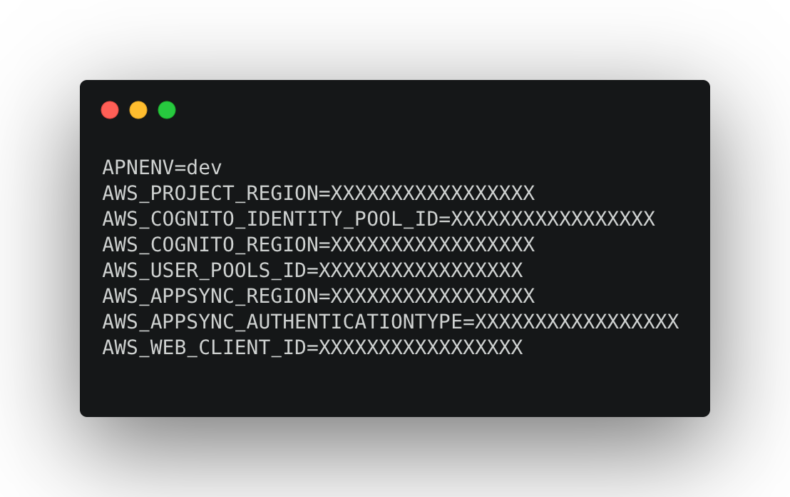
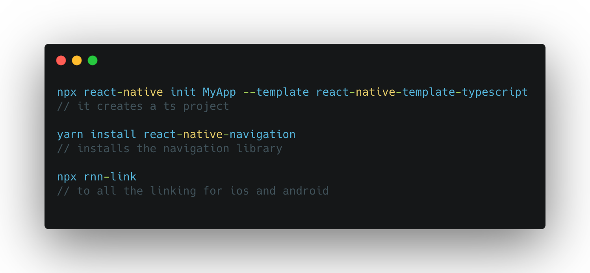

# React Native with Aws Amplify

A typescript project created using react-native-cli and configured with AWS Amplify 
for authentication with redux as stage management and react-native-navigation to handle the navigation and a powerful form library 
which can be configured with yup for validations.

Below packages and libraries are integrated
1. [React Native Navigation](https://wix.github.io/react-native-navigation/docs/before-you-start/)
2. [Redux](https://redux.js.org/)
3. [AWS Amplify](https://docs.amplify.aws/lib/auth/getting-started/q/platform/js) 
4. [React Hook Form](https://react-hook-form.com/)
5. [TypeScript](https://www.typescriptlang.org/)
6. [Yup](https://github.com/jquense/yup)
7. [Sentry](https://sentry.io/welcome/)
8. [React native Config](https://github.com/luggit/react-native-config)

## Workflow  

The great thing about AWS-Amplify is, once you logged in it uses react-native async storage to store session data, 
you don't have to do much stuff there. You can use Auth from amplify and say get me the current user, if you are logged 
in it will give you the session and user attributes.

Getting session info is simple and sleek.

I do think that getting a session every time the user loads the app takes a performance toll. We can use [redux-persist](https://github.com/rt2zz/redux-persist) 
and once the user is authenticated we manage a variable in store which tells us that the user is logged 
in we don't have to worry about the session token refresh and any stuff like that amplify takes care of that. 

## Managing dynamic env variables
It is configured with [React native Config](https://github.com/luggit/react-native-config) to manage dynamic env variables. All you need to do is create a .env file in
root directory and add any variables like below and react-native-config reads it and make it accessible to you across the app. 

## Ever changing JavaScript

Once you performed the above, you'll have a new react-native project, all you need to do is the copy the src folder and place it 
in the root directory and install the required packages and do a fresh build it should work fine. 

## Bonus

This is also configured with pre-commit hook ([husky](https://github.com/typicode/husky)), updated eslint config, some form examples, 
axios configuration to make api calls, helper functions for setting default style for rnn-navigation and navigate through screens, some components like buttons
header and logos. global style configs.  
